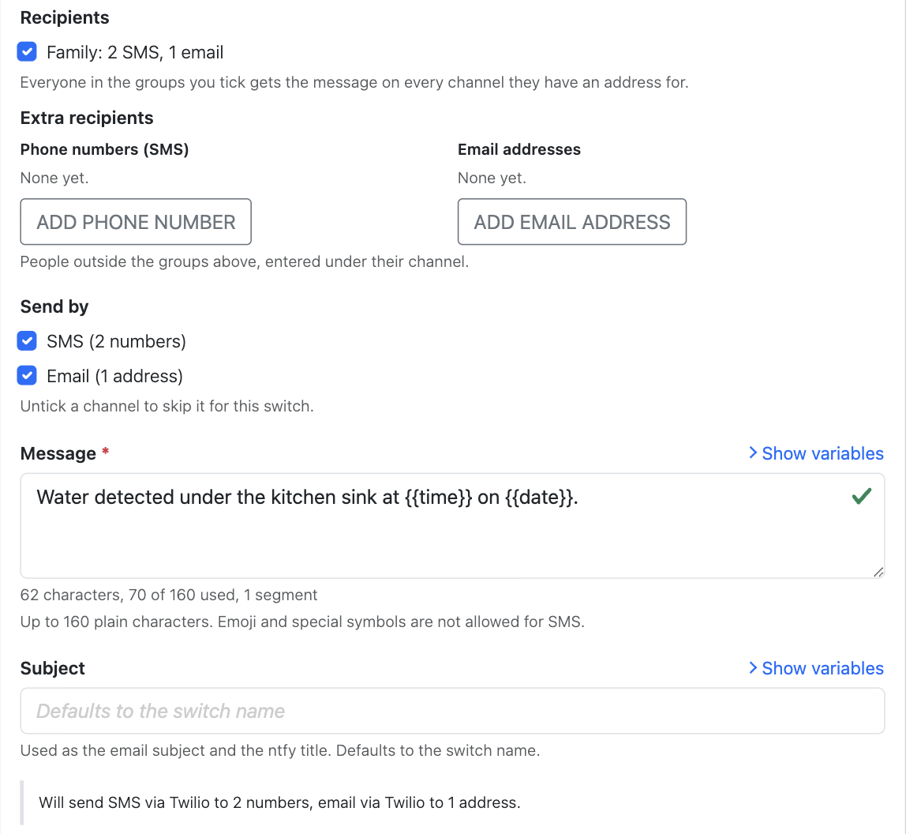

<!--
verified-by-homebridge: this plugin has not been through Homebridge verification yet.
Do not claim it. Once the plugin is verified, replace this comment with the badge:
[](https://github.com/homebridge/homebridge/wiki/Verified-Plugins)
-->

[](https://www.npmjs.com/package/homebridge-notify-switch)
[](https://github.com/arodbuilds/homebridge-notify-switch/actions/workflows/build.yml)

A [Homebridge](https://homebridge.io) plugin that exposes HomeKit switches which send a message when turned on. Turn a switch on from a HomeKit automation or scene, it sends one or more preset messages by SMS, email, Telegram, or ntfy push notification, and it turns itself back off. Any HomeKit event can notify people.

> **Status:** The configuration format is stable and covered by the full specification in [SPEC.md](https://github.com/arodbuilds/homebridge-notify-switch/blob/latest/SPEC.md). Please report problems in the [issue tracker](https://github.com/arodbuilds/homebridge-notify-switch/issues).

## Contents

- [Which channel should I use?](#which-channel-should-i-use)
- [What it does](#what-it-does)
- [Install](#install)
- [Five-minute Twilio SMS setup](#five-minute-twilio-sms-setup)
- [Provider setup guides](#provider-setup-guides)
  - [Twilio (SMS and email)](#twilio-sms-and-email)
  - [SMTP (email through your own mailbox)](#smtp-email-through-your-own-mailbox)
  - [Telegram](#telegram)
  - [ntfy](#ntfy)
- [Recipient groups](#recipient-groups)
- [Switches](#switches)
- [Using switches in HomeKit automations](#using-switches-in-homekit-automations)
- [Template variables](#template-variables)
- [Cooldown and master switch](#cooldown-and-master-switch)
- [Failure sensor](#failure-sensor)
- [Keeping secrets out of config.json with credentialsFile](#keeping-secrets-out-of-configjson-with-credentialsfile)
- [Backup, restore, and reset](#backup-restore-and-reset)
- [Child bridge](#child-bridge)
- [Security notes](#security-notes)
- [Troubleshooting](#troubleshooting)
- [Getting help](#getting-help)
- [Development](#development)
- [Changelog](#changelog)
- [About](#about)

## Which channel should I use?

1. **Email** is the easiest and cheapest place to start. You send through a mailbox you already have, and there is nothing to register and nothing to pay for. Ask each recipient to add your sending address to their contacts. Mail from a sender in the address book is far less likely to be filtered as spam.
2. **Telegram or ntfy** are the best options for push notifications on a phone. Both are free. Telegram needs each recipient to have a Telegram account; ntfy needs each recipient to install the ntfy app.
3. **SMS** is worth it only when the recipient will not install anything. In the United States, sending SMS through Twilio requires registration either way, which costs money and takes time to approve.

## What it does

Notify Switch is built from three things you configure once in the Homebridge UI:

1. **Provider**: a connection to a messaging service. Twilio sends SMS and, with an authenticated domain, email. SMTP sends email through a mailbox you already have, such as Fastmail, Gmail, or iCloud. Telegram sends to a chat through a bot you create. ntfy sends push notifications to the free ntfy app through a topic name you choose.
2. **Recipient group**: a named list of people, with phone numbers for SMS, email addresses for email, chat IDs for Telegram, and topic names for ntfy. You enter each person once and reuse the group everywhere.
3. **Switch**: a HomeKit switch that sends one message to the groups you pick, on every channel they have addresses for. In `config.json` each channel is one action: one provider, one channel, the groups, the message.

Every switch is always off in the Home app. When something turns it on, every action fires in parallel, the results are logged, and one second later the switch turns itself off. You only need one provider, one group, and one switch to start.

Things it does not do in this version: receive replies, report delivery status after the provider accepted a message, send MMS or attachments, WhatsApp, or fall back to a second channel when the first fails.

## Install

Requirements: Node.js 22.12 or newer (or 24), and Homebridge 1.6 or newer (2.x included).

- **Homebridge UI**: on the Plugins page search for the exact name `homebridge-notify-switch` and click **Install**.
- **Command line**: `sudo npm install -g homebridge-notify-switch`

The plugin does nothing until it is configured, and it never registers accessories while the configuration has errors. Running it as a [child bridge](#child-bridge) is recommended.

## Five-minute Twilio SMS setup

1. Sign in to the [Twilio Console](https://console.twilio.com) and copy the **Account SID** from **Account Info** on the home page. It starts with `AC`.
2. Open [API keys & tokens](https://console.twilio.com/us1/account/keys-credentials/api-keys) and create an API key. A **Standard** key works; so does a **Restricted** key with read and write access to Messaging. Copy the **SID** (starts with `SK`) and the **Secret**. The secret is shown once; keep it in a password manager. The Auth Token is deliberately not accepted, because an API key can be revoked without rotating your account's master credential.
3. Open [Active numbers](https://console.twilio.com/us1/develop/phone-numbers/manage/incoming) and copy a Twilio phone number you own, including the country code, for example `+16785550100`. Or skip this step: once the three credentials are in the form, **Look up numbers** lists your numbers and Messaging Services to pick from. If you send to US numbers, read [A2P 10DLC](#a2p-10dlc-registration-for-us-numbers) below; unregistered US long codes are filtered by the carriers.
4. In the Homebridge UI open the plugin settings and add a **Twilio** provider with those values, then click **Test connection**. Add a **Recipient group** with the phone numbers to notify (pick the country from the dropdown and type the national number). Add a **Switch**, give it a name such as `Water Leak Alert`, tick the group under **Recipients**, and type the message.
5. Click **Test send** on the switch to send it for real, then save and restart Homebridge. In the Home app create an automation with a trigger such as a leak sensor detecting water and add the switch with **Turn On** as the action.

## Provider setup guides

In the settings UI, **Add provider** asks which service should send your messages (Twilio, Email over SMTP, Telegram, or ntfy) and creates the card for it; the type cannot be changed afterwards, so remove the card and add another to switch. Every card has a **Show help** toggle in its header that collapses the field help once you know the form, and the help lines link back to the sections below.

Add only the providers you plan to use. Every provider has a **Test connection** button in the settings UI that checks the credentials without sending anything: SMTP logs in to the mail server, Twilio lists one message on your account (a read that both Standard and Messaging-scoped Restricted keys are allowed), Telegram asks the bot who it is, and ntfy checks the server's health and, when credentials are set, that it accepts them. Credentials in the form are used for that one request and are not stored until you click Save.

### Twilio (SMS and email)

Twilio serves the `sms` channel and, once a domain is authenticated, the `email` channel.

| Field | Where to find it |
| --- | --- |
| `accountSid` | [Console home page](https://console.twilio.com), **Account Info**. Starts with `AC`. |
| `apiKeySid` and `apiKeySecret` | [Account > API keys & tokens](https://console.twilio.com/us1/account/keys-credentials/api-keys). Create a **Standard** key, or a **Restricted** key with read and write access to Messaging. |
| `smsSenders` | [Phone Numbers > Manage > Active numbers](https://console.twilio.com/us1/develop/phone-numbers/manage/incoming). E.164 format with the country code. In the settings UI, **Look up numbers** lists them for you. |
| `messagingServiceSid` | Optional. [Messaging > Services](https://console.twilio.com/us1/develop/sms/services). Starts with `MG`. In the settings UI it is under the Twilio card's **Advanced** disclosure, and **Look up numbers** can fill it. |
| `emailFrom` | Optional. Required only for the `email` channel. The domain must be authenticated (see below). |

#### API keys

1. Open [API keys & tokens](https://console.twilio.com/us1/account/keys-credentials/api-keys) and click **Create API key**.
2. Give it a name such as `Homebridge` and create it. **Standard** is the simplest choice. A **Restricted** key also works if you grant it read and write access to Messaging; Test connection reads the message list and sending creates messages, so both are needed.
3. Copy the **SID** into `apiKeySid` and the **Secret** into `apiKeySecret`. The secret cannot be shown again; if you lose it, delete the key and create a new one.

A Standard key can send messages but cannot manage the account, and a Restricted key can do only what you grant it. If a key leaks, delete it in the Console and create another; the plugin never asks for the Auth Token, so the account's master credential stays untouched. Full details: [Twilio API keys](https://www.twilio.com/docs/iam/api-keys).

#### Phone numbers

List every Twilio number you want to send from in `smsSenders`. In the settings UI, click **Look up numbers** on the Twilio card once the Account SID, API Key SID and API Key Secret are filled: it lists the first 20 numbers on the account with their friendly names and the first 20 Messaging Services, and picking one adds it to the list or fills the Messaging Service SID. A Restricted key without permission to list numbers gets "This API key cannot list numbers. Enter them manually." and typing them still works. An SMS action with a `sender` uses that number; an action without one uses the provider's only number, or the Messaging Service when `messagingServiceSid` is set. If you need to buy a number, use [Phone Numbers > Manage > Buy a number](https://console.twilio.com/us1/develop/phone-numbers/manage/search) and make sure it is SMS capable.

Trial accounts can only send to phone numbers verified under [Verified Caller IDs](https://console.twilio.com/us1/develop/phone-numbers/manage/verified) and prefix every message with a trial notice. Upgrade the account before relying on it for alerts.

#### A2P 10DLC registration for US numbers

Messages from a standard US long code to US phone numbers must come from a number registered for [A2P 10DLC](https://www.twilio.com/docs/messaging/compliance/a2p-10dlc). Unregistered traffic is blocked by the carriers and shows up in Twilio's message logs with error 30034. Register in the Console under **Messaging > Regulatory Compliance** (a brand, then a campaign, then attach your number to the campaign's Messaging Service). A registered number is normally attached to a Messaging Service, so set `messagingServiceSid` on the provider and omit `sender` on the action. Toll-free numbers use a separate [toll-free verification](https://www.twilio.com/docs/messaging/compliance/toll-free/console-onboarding) instead; numbers outside the US are not affected.

Registration notes:

1. **Sole Proprietor 10DLC registration** is the lightest path for a household: a one-time brand and campaign fee plus a small monthly campaign fee. It allows one campaign per brand, one phone number per campaign, and a throughput of 1 message per second (as of September 2026, per Twilio's [Sole Proprietor Brands FAQ](https://support.twilio.com/hc/en-us/articles/9550596959643-A2P-10DLC-Sole-Proprietor-Brands-FAQ)). See [Sole Proprietor registration](https://www.twilio.com/docs/messaging/compliance/a2p-10dlc/direct-sole-proprietor-registration-overview).
2. **Toll-free verification** is an alternative that skips A2P 10DLC brand and campaign registration. A toll-free number cannot send to US or Canadian numbers until Twilio approves the verification, and the submission asks for business and use-case details. See [Toll-free verification in the Console](https://www.twilio.com/docs/messaging/compliance/toll-free/console-onboarding).
3. **Fees.** As of September 2026, Sole Proprietor registration costs $4 once for the brand, $15 once for campaign vetting, and $2 per month per campaign, per Twilio's [Sole Proprietor Brands FAQ](https://support.twilio.com/hc/en-us/articles/9550596959643-A2P-10DLC-Sole-Proprietor-Brands-FAQ). Twilio's per-message price and the carrier surcharges are on [Twilio's US SMS pricing page](https://www.twilio.com/en-us/sms/pricing/us).

#### Email through Twilio

The `email` channel sends through Twilio's Emails API, which needs an authenticated sending domain.

1. In the Console open **Communications > Email > Domains** and add the domain you want to send from.
2. Add the DNS records Twilio shows to your domain and wait for the domain to show as verified.
3. Set `emailFrom.address` to an address at that domain and `emailFrom.name` to the display name recipients see.

Emails are sent as plain text. Every message carries the `Auto-Submitted: auto-generated` header so mail systems treat it as automated. An email action on a Twilio provider without `emailFrom` is reported as a configuration error at startup. If you do not own a domain, use an [SMTP provider](#smtp-email-through-your-own-mailbox) instead.

Twilio Email adds an open-tracking pixel to every message. As of September 2026 there is no setting to turn it off, per message or per account: the Emails API has no tracking field and the [Email settings in the Twilio Console](https://www.twilio.com/docs/email/settings) cover only event forwarding, IP addresses, and the address allow list. Twilio Email also sends from shared SendGrid IP addresses whose reputation is outside your control. A household that wants neither should send through its own [SMTP mailbox](#smtp-email-through-your-own-mailbox), which sends exactly the plain text the plugin writes.

### SMTP (email through your own mailbox)

SMTP serves the `email` channel through any mail account. The plugin sends one message per action with every recipient in `To`, so recipients see each other; tick **Hide recipients from each other (BCC)** on an action to put them in `Bcc` with your from address in `To` instead (a message to one recipient always uses `To`). TLS certificate verification is always on.

In the settings UI the SMTP card opens with a **Mail provider** picker (Fastmail, Gmail, iCloud, Outlook.com, Yahoo, Zoho, Other). Picking one fills the server settings below and locks them (click **Edit** to change them), and the password help links straight to that provider's app-password page. Choose **Other** for any other mail server.

| Field | Value |
| --- | --- |
| `host`, `port`, `security` | Your provider's outgoing server (table below). `ssl` is SMTP over TLS, usually port 465; `starttls` upgrades a plain connection, usually port 587. |
| `username` | Usually your full email address. |
| `password` | Almost always an **app password**, not your login password. |
| `from.address`, `from.name` | An address your provider allows you to send from, and an optional display name. |

| Provider | Host | Port | Security |
| --- | --- | --- | --- |
| Fastmail | `smtp.fastmail.com` | 465 | `ssl` |
| Gmail | `smtp.gmail.com` | 465 | `ssl` |
| iCloud | `smtp.mail.me.com` | 587 | `starttls` |
| Outlook.com | `smtp-mail.outlook.com` | 587 | `starttls` |
| Yahoo | `smtp.mail.yahoo.com` | 465 | `ssl` |
| Zoho | `smtp.zoho.com` | 465 | `ssl` |

#### App passwords

Every provider below wants an app password rather than your login password: a password created for one program, which you can revoke on its own without changing your account password. The settings UI's "Where do I create one?" link brings you here; pick your provider.

#### Fastmail

1. Open [Settings > Privacy & Security > App passwords](https://app.fastmail.com/settings/security/devices) and click **New app password**.
2. Name it `Homebridge`, choose the **SMTP** access scope, and generate it. Copy the password; it is shown once.
3. Use `smtp.fastmail.com`, port `465`, `ssl`, your full Fastmail address as `username`, the app password as `password`, and your Fastmail address (or one of its aliases) as `from.address`.

Fastmail help: [App passwords](https://www.fastmail.help/hc/en-us/articles/360058752854-App-passwords) and [Server names and ports](https://www.fastmail.help/hc/en-us/articles/1500000278342-Server-names-and-ports).

#### Gmail

1. Turn on 2-Step Verification for your Google account if it is not already on; app passwords require it.
2. Open [App passwords](https://myaccount.google.com/apppasswords), enter a name such as `Homebridge`, and click **Create**. Copy the 16-character password without the spaces.
3. Use `smtp.gmail.com`, port `465`, `ssl`, your Gmail address as `username`, the app password as `password`, and your Gmail address as `from.address`. Gmail rewrites `from.address` to your account address unless it is a configured "Send mail as" alias.

Google Workspace accounts may have app passwords disabled by the administrator. Google help: [Sign in with app passwords](https://support.google.com/accounts/answer/185833) and [Gmail SMTP settings](https://support.google.com/mail/answer/7126229).

#### iCloud

1. Sign in at [account.apple.com](https://account.apple.com/account/manage), open **Sign-In and Security > App-Specific Passwords**, and generate one named `Homebridge`. Two-factor authentication must be on.
2. Use `smtp.mail.me.com`, port `587`, `starttls`, your full iCloud address as `username`, the app-specific password as `password`, and your iCloud address (or an alias, or an iCloud+ custom domain address) as `from.address`.

Apple help: [App-specific passwords](https://support.apple.com/102654) and [Mail server settings for iCloud](https://support.apple.com/102525).

#### Outlook.com

1. Turn on two-step verification for your Microsoft account, then open [App passwords](https://account.live.com/proofs/AppPassword) and create one.
2. Use `smtp-mail.outlook.com`, port `587`, `starttls`, your full address as `username`, the app password as `password`, and your Outlook.com address as `from.address`.

Microsoft is retiring password sign-in for third-party apps on personal accounts. If the mail server rejects an app password with `EAUTH`, use Fastmail, Gmail, iCloud, or Twilio for email instead. Microsoft help: [POP, IMAP, and SMTP settings for Outlook.com](https://support.microsoft.com/office/pop-imap-and-smtp-settings-for-outlook-com-d088b986-291d-42b8-9564-9c414e2aa040).

#### Yahoo

1. Open [Generate and manage third-party app passwords](https://help.yahoo.com/kb/SLN15241.html) and follow the steps to create an app password named `Homebridge`.
2. Use `smtp.mail.yahoo.com`, port `465`, `ssl`, your full Yahoo address as `username`, the app password as `password`, and your Yahoo address as `from.address`.

#### Zoho

1. Open [Zoho Accounts > Security > App Passwords](https://accounts.zoho.com/home#security/app_passwords) and generate one named `Homebridge`.
2. Use `smtp.zoho.com` (or your region's Zoho host, such as `smtp.zoho.eu`), port `465`, `ssl`, your full Zoho address as `username`, the app password as `password`, and your Zoho address as `from.address`.

#### Other mail servers

Any server that accepts an authenticated SMTP login works, including a mail relay on your own network, as long as its certificate is valid for the host name you enter. Self-signed certificates are rejected because verification cannot be turned off. Use `security: "none"` only for a server on a trusted network that offers no TLS at all; the password travels in clear text in that case.

### Telegram

Telegram serves the `telegram` channel through a bot you create. The Telegram provider card in the settings UI walks you through it in three steps; the same steps are below for the schema form.

**Step 1: Create your bot.** On your phone, scan the QR code on the card with the camera to open [@BotFather](https://t.me/BotFather) in Telegram. On a computer with Telegram installed, click **Open BotFather** instead. Then, in the BotFather chat:

1. Send /newbot.
2. Choose a display name such as Home Alerts.
3. Choose a username ending in bot, for example homealerts_bot.
4. BotFather replies with a token. Copy it and paste it below.

The token looks like `123456789:AAF…`. Treat it like a password; anyone with the token can send as the bot. As soon as you paste a valid token, the card checks it with Telegram and shows "Connected to @yourbot" or the error.

**Step 2: Choose how people receive messages.** Pick one of the two cards; the choice decides what step 3 shows.

- **Family group chat (recommended)**: everyone in the group gets every message. Nobody has to opt in individually.
- **Individual chats**: each person opens the bot and taps Start once.

**Step 3, for a family group: Add the bot to your group.** The card shows a QR code and an **Add bot to a group** button for the same link. Open Telegram on your phone and scan, or click the button, then pick your family group or create one. Everyone in the group will get alerts. **Copy link** copies the link to send to whoever manages the group.

**Step 3, for individual chats: Invite people.** The card shows a QR code that opens the bot with a Start button. **Enlarge** shows it full screen for people in the room to scan, **Copy link** copies the link, and **Copy invite message** copies a ready-to-send text: "Tap this link and press Start to get alerts from our home: https://t.me/yourbot?start=join".

On a phone or tablet the QR codes are replaced by **Open in Telegram**, **Copy link** and, where the browser offers it, **Share**, because a phone cannot scan its own screen.

Then click **Find people and groups**. The plugin calls the bot's `getUpdates` and lists everyone who has opened the bot (first name and username) and every group the bot has been added to (the group title; groups appear as soon as the bot joins, before anyone posts). Choose the recipient group in the dropdown and click **Add** next to each person or group. Added people appear in the group's Telegram chat IDs list; save when you are done. Private chats have positive IDs; groups and channels have negative IDs such as `-1001234567890`.

`parseMode` is `none` by default and sits under the Telegram card's **Advanced** disclosure, so the body is sent as plain text. Choose `markdown` or `html` only if you write bodies in [Telegram's formatting syntax](https://core.telegram.org/bots/api#formatting-options); a body that does not parse in the selected mode is rejected by Telegram with error 400.

If **Find people and groups** reports error 409, a webhook is set on the bot from another tool, and `getUpdates` cannot be used. Remove it with `deleteWebhook` or create a separate bot for Homebridge. More on bots: [Bots: An introduction for developers](https://core.telegram.org/bots).

### ntfy

ntfy serves the `ntfy` channel: free push notifications to the [ntfy app](https://ntfy.sh) on your phone, with no account needed for public topics on ntfy.sh. In the settings UI pick the **ntfy** tile; the card explains the same steps.

1. Install the app: [iOS](https://apps.apple.com/us/app/ntfy/id1625396347), [Android](https://play.google.com/store/apps/details?id=io.heckel.ntfy) (also on [F-Droid](https://f-droid.org/en/packages/io.heckel.ntfy/)), or use the [web app](https://ntfy.sh/app).
2. In the app, subscribe to a topic name of your choosing, for example `home-alerts-x7q2`. Letters, numbers, dashes and underscores, up to 64 characters.
3. Add that topic to a recipient group under **ntfy topics**; a switch that sends to that group gets an **ntfy** checkbox under **Send by**.

**Anyone who knows the topic name can read it, and can publish to it.** Topics on ntfy.sh are public: there is no password on a topic, only its name. Pick something unguessable (a word plus random characters), or reserve the topic with an access token so only you can publish to it.

| Field | Value |
| --- | --- |
| `server` | `https://ntfy.sh` unless you run [your own server](https://docs.ntfy.sh/install/). Must start with `http://` or `https://`; a path is allowed for a server behind a prefix. |
| `auth` | `none` (default), `token`, or `basic`. |
| `token` | The access token when `auth` is `token`. Recommended: in the ntfy app or web app, sign in, open **Account > Access tokens**, create one, and reserve your topic under **Reserved topics** so nobody else can publish to it. A token can be revoked on its own. |
| `username`, `password` | Your ntfy account login when `auth` is `basic`. A token is safer. |

On the ntfy channel the switch's **Subject** is the notification title (defaults to the switch name), and under the switch's **Advanced** disclosure there is a **Priority** (`min`, `low`, `default`, `high`, `urgent`; `high` and `urgent` can break through Do Not Disturb, `min` shows no notification) and up to eight **Tags** such as `warning` or `house`, which the app shows as emoji when they are [emoji short codes](https://docs.ntfy.sh/emojis/). Bodies are plain text up to 4,096 characters; ntfy.sh limits a message to 4,096 bytes, so a body full of emoji may be a little shorter.

**Test connection** checks the server's health and, when credentials are set, that the server accepts them; it publishes nothing. **Test send** on a switch publishes for real.

## Recipient groups

A group is a named list of people. Each group has four lists: `sms` (phone numbers), `email` (email addresses), `telegram` (chat IDs), and `ntfy` (topic names). A switch sends to whichever lists match the channels it has ticked, so one `Family` group can receive the same message by SMS and by email at the same time.

- Phone numbers are stored in E.164 format, for example `+16785550101`. In the settings UI pick the country from the dropdown and type the national number as you like (digits, spaces, dashes, dots, parentheses); nothing is reformatted while you type. When you leave the field the number is checked, stored with its country code, and shown in the national format, and the country dropdown follows the number (a +1 305 number is United States even if Canada was selected). Pasting a number that already has a country code works the same way. A number in `config.json` without a leading `+` is normalized using `defaultCountry` and the normalized value is logged once at startup.
- Email addresses are validated on entry. Telegram chat IDs are numbers, not usernames; use **Find people and groups** on the Telegram provider card to add them. ntfy topics are the names subscribed in the ntfy app (letters, numbers, dashes and underscores); see the [topic-name warning](#ntfy).
- A group with no addresses is valid but produces a startup warning if a switch uses it.

Provider and group names may hold letters, numbers, spaces, and punctuation, up to 64 characters; control characters and angle brackets are not allowed. The settings UI enforces this, and a name in `config.json` that breaks the rule is reported as a startup warning naming the field.

Group and provider IDs are short slugs generated from the name (`family`, `twilio`, with a numeric suffix such as `twilio-2` when the name is taken). They are how switches refer to groups and providers in `config.json`, so renaming a group in the UI does not break the switches that use it. The settings UI keeps them out of the main form; open a card's **Advanced** disclosure and click **Edit** next to the ID if you hand-edit `config.json` and need a particular value.

## Switches

Each switch appears in the Home app under its `name`. Turning it on sends your message to everyone in the groups you pick, on every channel they have, then the switch turns itself off.

In the settings UI a switch card has four parts:

1. **Recipients.** Tick the groups to send to. Each group shows what it holds per channel, for example `Family: 3 SMS, 1 email, 2 ntfy`. Under **Extra recipients** you can add individual phone numbers, email addresses, Telegram chat IDs or ntfy topics for people outside the groups.
2. **Send by.** One checkbox per channel your recipients can be reached on, ticked by default as soon as it appears (whether you ticked a group here, gave a group its first address on that channel, or added a provider for it), each with the number of people it reaches: `SMS (3 numbers)`, `Email (1 address)`. Untick a channel to skip it for this switch. A channel nobody can be reached on is not listed. A channel this switch already sends on whose provider has been removed stays listed, greyed out, with the note `No provider configured for Telegram; add one or untick to remove.`; add a provider or untick it before saving.
3. **Message.** One message for every channel. While SMS is ticked a counter shows the characters and segments used and flags characters SMS cannot carry. A **Subject** field appears while email or ntfy is ticked; it is the email subject and the ntfy title, and defaults to the switch name. Template variables work in both (see [Template variables](#template-variables)): **Show variables** next to either field lists them with what each would render right now, and clicking one inserts it at the cursor.
4. A preview line says exactly what will happen: `Will send SMS via Twilio to 3 numbers, email via Fastmail to 1 address, ntfy via ntfy to 2 topics.`



*One message, recipients picked by group, channels derived from what those recipients have.*

Open **Advanced** on the card when you need more:

- **Customize message per channel** gives each ticked channel its own message (and, for email and ntfy, its own subject or title), each starting as a copy of the shared message.
- A **provider** dropdown appears for a channel that more than one provider can send on. It defaults to `Platform default (…)`, the provider chosen under **Settings**; pick another to send this switch's messages through it instead.
- **Hide recipients from each other (BCC)** for email, the **Sender** number for SMS when the Twilio provider has several, and the ntfy **Priority** and **Tags**.

When more than one provider can send on a channel, the first one in the list is the default as soon as the second one is filled in, and the settings UI writes that choice to `config.json` so nothing is left undecided. The new provider's card then asks, at the bottom, "You now have 2 ways to send email. Switches use Fastmail unless told otherwise. Which should they use?" with the new provider preselected: **Use the selected provider** switches the default to your pick, **Keep Fastmail** leaves it. Each provider card's header shows **Default for email** on the default and a **Make default for email** button on the others, and the choice is also under **Settings > Default … provider**. Switches that do not name a provider under Advanced follow that default. See [Platform defaults](#platform-defaults) for the stored form.

The other switch fields:

| Field | Meaning |
| --- | --- |
| `name` | Shown in the Home app. Letters, numbers, spaces, and apostrophes; must start and end with a letter or number; at most 64 characters; unique. |
| `enabled` | Default `true`. A disabled switch is still registered so automations keep working, but does nothing when flipped and logs the suppression. |
| `cooldownSeconds` | Minimum seconds between sends, 0 to 86400. `0` disables the cooldown. See [Cooldown and master switch](#cooldown-and-master-switch). |
| `failureMode` | `any` (default), `all`, or `off`. See [Failure sensor](#failure-sensor). |
| `failureSensor`, `failureSensorResetSeconds` | Adds a contact sensor that trips on failure; reset timeout defaults to 300 seconds. |

### Actions in config.json

In `config.json` a switch holds an `actions` array, one action per channel it sends on. The settings UI writes that array from the card above and reads it back; you only need to know its shape if you edit the file by hand or use the schema form. Each action has:

| Field | Meaning |
| --- | --- |
| `providerId` | The provider to send through. |
| `channel` | `sms`, `email`, `telegram`, or `ntfy`. Must be a channel that provider serves. |
| `sender` | SMS only. One of the provider's `smsSenders`. Omit it when the provider has one number or uses a Messaging Service. |
| `groups` | Recipient groups to send to. |
| `recipients` | Extra individual addresses for this channel, on top of the groups. At least one address must come from `groups` or `recipients`. |
| `subject` | Email and ntfy. The email subject or the ntfy notification title. Defaults to the switch name. Line breaks are removed. |
| `bcc` | Email only, default `false`. **Hide recipients from each other (BCC)**: recipients go in `Bcc` and the from address in `To`. A message to a single recipient always uses `To`. |
| `priority` | ntfy only. `min`, `low`, `default` (the default), `high`, or `urgent`. |
| `tags` | ntfy only. Up to 8 tags of letters, numbers, dashes, underscores and plus signs; emoji short codes show as icons in the app. |
| `body` | The message. SMS: 1 to 160 characters from the GSM-7 set, so no emoji. Email: up to 10,000 characters of plain text. Telegram: up to 4,096 characters. ntfy: up to 4,096 characters. |

Recipients from every group plus `recipients` are merged and deduplicated before sending; an action may reach at most 100 recipients. Each SMS, Telegram and ntfy message is one request per recipient with at most five in flight per provider; email is one message per action. Every request has a 10 second timeout and one retry.

A configuration with several actions on the same channel on one switch (two SMS messages from one switch, say, as 1.0.x allowed) still starts and sends every action, but the settings UI cannot show it: it displays a warning that upgrading to 1.1 requires reconfiguring the plugin and offers only **Download backup**, **Download backup without credentials** and **Reset plugin to fresh install** until the reset is done. Download a backup for reference, reset, and set the switches up again, using two switches where you had two messages on one channel. A switch that sends to a group with addresses on a channel it has no action for is reported once at startup as a warning, because those people receive nothing; in the settings UI that channel simply shows unticked under **Send by**.

### Platform defaults

`defaultProviders` on the platform block maps a channel to the id of the provider switches use on it when more than one provider can send on that channel, for example `"defaultProviders": { "email": "fastmail" }`. Only channels with several providers carry an entry; with one provider it is the default on its own. The settings UI writes the entry as soon as a channel has two providers, so a configuration it saved always has one. A hand-edited configuration with several providers and no entry falls back to the first in `config.json` order with a startup warning; an entry naming a provider that does not exist, or one that cannot send on that channel, is a startup error.

The **Test send** button in a switch card's footer asks "Send to {n} recipients now?" and, after you click **Send**, sends to the real recipients on every ticked channel and lists the result for each recipient. It ignores the master switch and the cooldown, and it works before you save. While the switch, or a provider or group it uses, has a validation error the button is disabled with "Fix the errors above first" beside it; while nobody would receive anything it reads "No recipients yet".

The plugin checks the whole configuration when Homebridge starts and logs every problem with its field path, for example:

```
switches[0].actions[0].providerId: no provider with id "twillio-main" (did you mean "twilio-main"?)
```

While there are errors nothing is registered. Cached accessories are left in place, so your HomeKit automations survive while you fix a typo. The settings UI runs the same checks and keeps **Save** disabled while any remain. A configuration with no switches at all is valid: nothing is registered and every cached accessory is removed from HomeKit (see [Backup, restore, and reset](#backup-restore-and-reset)).

<details>
<summary>Example platform block in config.json</summary>

The settings UI and the schema form write this structure. Every field is documented in the settings UI.

```json
{
  "platform": "NotifySwitch",
  "name": "Notify Switch",
  "defaultCountry": "US",
  "masterSwitch": { "enabled": true, "name": "Notifications Enabled" },
  "debug": false,
  "providers": [
    {
      "id": "twilio-main",
      "type": "twilio",
      "name": "Twilio",
      "accountSid": "AC...",
      "apiKeySid": "SK...",
      "apiKeySecret": "...",
      "smsSenders": ["+16785550100"]
    },
    {
      "id": "fastmail",
      "type": "smtp",
      "name": "Fastmail",
      "host": "smtp.fastmail.com",
      "port": 465,
      "security": "ssl",
      "username": "alex@example.com",
      "password": "app-password",
      "from": { "address": "alex@example.com", "name": "Home" }
    },
    {
      "id": "telegram-home",
      "type": "telegram",
      "name": "Telegram",
      "botToken": "123456789:AAF..."
    }
  ],
  "groups": [
    {
      "id": "family",
      "name": "Family",
      "sms": ["+16785550101", "+16785550102"],
      "email": ["a@example.com"],
      "telegram": ["123456789"]
    }
  ],
  "switches": [
    {
      "id": "6f1c2a9e-2b1c-4b8f-9d1e-0c5a1e2f3a4b",
      "name": "Water Leak Alert",
      "enabled": true,
      "cooldownSeconds": 60,
      "failureMode": "any",
      "failureSensor": false,
      "actions": [
        {
          "providerId": "twilio-main",
          "channel": "sms",
          "groups": ["family"],
          "body": "Water detected under the kitchen sink at {{time}}."
        },
        {
          "providerId": "fastmail",
          "channel": "email",
          "groups": ["family"],
          "subject": "Water leak: kitchen",
          "body": "Water detected under the kitchen sink at {{time}}."
        },
        {
          "providerId": "telegram-home",
          "channel": "telegram",
          "groups": ["family"],
          "body": "Water detected under the kitchen sink at {{time}}."
        }
      ]
    }
  ]
}
```

</details>

## Using switches in HomeKit automations

After saving, restart Homebridge. Your switches appear in the Home app in the room you assign them, and you can tap one to send its messages right away.

To send on an event:

1. In the Home app open **Automation** and tap **+**.
2. Choose a trigger: **An Accessory is Controlled** (a leak sensor detects water, a door opens, a smoke detector alarms), **A Sensor Detects Something**, **People Arrive** or **Leave**, or **A Time of Day Occurs**.
3. On the accessories screen select your Notify Switch and make sure its action is **Turn On**.
4. Optionally tap the switch and use **Convert to Shortcut** to add conditions, for example only at night or only when nobody is home.

Scenes work the same way: add the switch to a scene with the state on, and every time the scene runs the messages are sent. The switch turns itself off one second after each send, so an automation that turns it on again later still fires. Turning the switch off from the Home app does nothing.

Since HomeKit only ever sees the switch flip on and off, an automation that fires repeatedly, such as a motion sensor, will send on every trigger. Use [`cooldownSeconds`](#cooldown-and-master-switch) to rate-limit it.

## Template variables

These placeholders can be used in `body` and `subject`:

| Variable | Value |
| --- | --- |
| `{{switchName}}` | The switch's name. |
| `{{time}}` | The local time, for example `5:15 PM`. |
| `{{date}}` | The local date, for example `9/8/2026`. |
| `{{datetime}}` | Both together, for example `9/8/2026 5:15 PM`. |

The examples are the defaults. Two settings under **Settings** in the plugin's settings page choose the form (`timeFormat` and `dateFormat` in `config.json`):

| Setting | Options | `{{time}}` or `{{date}}` |
| --- | --- | --- |
| **Time format** | 12-hour (default) or 24-hour | `5:15 PM` or `17:15` |
| **Date format** | Month/Day/Year (default), Day/Month/Year or Year-Month-Day | `9/8/2026`, `8/9/2026` or `2026-09-08` |

`{{datetime}}` is the date, a space, then the time, in whichever forms you chose. Times use the Homebridge host's time zone. Anything else inside double braces is left exactly as typed. Variables are expanded when the switch is flipped, so `{{time}}` is the moment the event happened.

Before 1.2.0 the variables always rendered as `14:05`, `2026-09-08` and `2026-09-08T14:05:00`. Choose 24-hour and Year-Month-Day to keep the old time and date; `{{datetime}}` no longer includes seconds.

## Cooldown and master switch

**Cooldown.** `cooldownSeconds` sets the minimum time between sends for one switch. Flips inside the window are ignored and logged at info level with the remaining time, so a motion sensor that triggers every few seconds sends one message per window instead of dozens. The cooldown is per switch and starts when a send begins; a restart of Homebridge clears it.

**Master switch.** A platform-level switch named `Notifications Enabled` by default appears in the Home app. While it is off, no switch sends anything and every flip is logged as suppressed. Use it as a single kill switch when you are testing automations or having work done at home. Its state survives a Homebridge restart. Rename it with `masterSwitch.name`, or set `masterSwitch.enabled` to `false` to hide it entirely; sends are then never suppressed. **Test send** in the settings UI bypasses the master switch.

## Failure sensor

Set `failureSensor` to `true` on a switch to add a contact sensor to the same accessory, so it shares the switch's room and name in the Home app. The contact opens when a send fails and closes on the next fully successful send from that switch or after `failureSensorResetSeconds` (default 300 seconds).

`failureMode` decides what counts as a failure:

- `any` (default): the sensor trips if any recipient on any channel fails.
- `all`: the sensor trips only if every recipient on every channel fails.
- `off`: the sensor never trips. Failures are still logged.

Use the sensor in a HomeKit automation, for example to flash a light or send a notification through a second switch, so you find out when a message did not go out. Failures are always logged at warn level with the provider's error code and a short message, whether or not the sensor is enabled.

## Keeping secrets out of config.json with credentialsFile

Credentials live in `config.json` like every Homebridge plugin. If you prefer to keep them out of it, and out of Homebridge UI backups and screenshots, set `credentialsFile` on a provider to the path of a JSON file. A relative path is resolved against the Homebridge storage directory (the folder that holds `config.json`, usually `/var/lib/homebridge` or `~/.homebridge`); an absolute path is used as is.

The file's keys override the provider's secret fields:

| Provider | Keys |
| --- | --- |
| `twilio` | `accountSid`, `apiKeySid`, `apiKeySecret` |
| `smtp` | `username`, `password` |
| `telegram` | `botToken` |
| `ntfy` | `token`, `username`, `password` |

Example: `notify-switch-twilio.json` in the storage directory containing `{ "apiKeySecret": "..." }`, with `"credentialsFile": "notify-switch-twilio.json"` on the Twilio provider. Any secret field still present in `config.json` is used for keys the file does not set, and a key that is not a secret field of that provider type is ignored with a warning.

The file is read once at startup, and again when the settings UI runs **Test connection** or **Test send**. A missing or malformed file is reported as a configuration error with the field path and nothing is registered. Make the file readable only by the user Homebridge runs as, for example `chmod 600`.

## Backup, restore, and reset

At the bottom of the **Settings** section of the settings UI, the **Advanced** disclosure holds three actions:

- **Download backup** saves the current platform configuration as `notify-switch-backup-YYYY-MM-DD.json`. The file contains your provider credentials, so store it like a password.
- **Download backup without credentials** saves the same file as `notify-switch-backup-without-credentials-YYYY-MM-DD.json` with every secret (API key secret, SMTP password, bot token, and every field a `credentialsFile` may supply) replaced by an empty string and `"credentialsRemoved": true` at the top. It is safe to attach to an issue when [asking for help](#getting-help).
- **Restore from backup** takes either file (or a whole Homebridge `config.json` holding a NotifySwitch block), checks it against the same rules the form applies, and lists every problem if it fails. If it passes, the form is replaced with the file's contents and **Save** is enabled; nothing is written until you click Save. A backup without credentials loads with its secret fields empty and marked as errors, so **Save** stays disabled until you enter them again.
- **Reset plugin to fresh install** opens a confirmation that lists what happens: all providers, groups, switches, and settings are removed; switches disappear from the Home app after the next restart; credentials files on disk are not touched. It offers **Download backup first**, and the red **Confirm** button stays disabled until you type `RESET`. Confirming replaces the form with the empty default configuration and enables **Save**.

After you save a configuration with no switches and restart Homebridge, the plugin removes every accessory it had registered, including the master switch, and forgets the master switch position and any failure sensor state. A configuration with errors never does this: cached accessories stay until the errors are fixed.

## Child bridge

Running this plugin as a [child bridge](https://github.com/homebridge/homebridge/wiki/Child-Bridges) is recommended. Sending goes out over the internet, and a slow or unreachable messaging service then cannot delay your other accessories. In the Homebridge UI open the plugin's menu, choose **Bridge Settings**, enable the child bridge, save, restart, and pair the new bridge in the Home app with the QR code shown.

## Security notes

- **Homebridge UI backups contain `config.json`.** A backup archive includes every provider password, API key secret, and bot token you configured inline. Store backups as you would a password file and delete old ones. [`credentialsFile`](#keeping-secrets-out-of-configjson-with-credentialsfile) keeps secrets out of the backup.
- Twilio accepts API keys only, never the Auth Token, so a leaked key can be revoked without touching the account. SMTP setups should use an app password that you can revoke on its own. A Telegram bot token only controls that bot; revoke it with BotFather's `/revoke`. An ntfy access token can be revoked on its own under the account's access tokens; prefer it over the account password, and remember that a topic name is the only thing protecting a public ntfy topic.
- Credentials are never written to the log at any level. Phone numbers, email addresses, chat IDs and topic names are partially masked at info level (`+1678***0101`, `a***@example.com`), and message bodies are logged only when `debug` is on. Provider errors are reduced to a code and a short message before logging, and every log line has control characters escaped, so nothing in a configuration value or a provider's reply can forge a log line.
- The settings UI's **Test connection**, **Look up numbers**, **Find people and groups**, and **Test send** use the credentials from the form in memory for that one request and never store, log, or return them. They only connect to the mail host and the ntfy server you configured and to Twilio's and Telegram's APIs.
- **Download backup** writes the same credentials into the file you download. Treat it like `config.json`. **Download backup without credentials** leaves every secret out; that is the file to share.
- TLS certificate verification cannot be disabled.
- Email subjects and from names have line breaks removed. Telegram bodies are sent as plain text unless you choose a `parseMode`.
- Cooldown and the master switch limit the damage from a runaway automation.
- The plugin has no analytics, writes no files, and reads only the `credentialsFile` you point it at.

## Troubleshooting

Turn on `debug` in the plugin settings to see full addresses, message bodies, retries, and the response codes behind each failure in the Homebridge log. Every send logs one line per recipient and one summary line per switch:

```
[Water Leak Alert] sms via twilio-main to +1678***0101: sent (SM3f2...)
[Water Leak Alert] 1 of 1 message sent
```

### General

- **Nothing appears in HomeKit after a restart**: look for lines starting with a field path such as `switches[0].actions[0].body` in the log. The configuration has errors and nothing is registered until they are fixed. The settings UI lists the same errors.
- **The switch flips but nothing is sent**: the log says why. `flip suppressed: master switch ... is off` means the master switch is off; `switch is disabled` means `enabled` is false; `cooldown active` means the cooldown has not expired.
- **`request timed out after 10s`**: the provider did not answer within 10 seconds. The plugin retries once. Check the host's internet connection and DNS; on a Raspberry Pi, also check that the clock is right, since TLS fails with a wrong date.
- **The message arrived but a variable was not replaced**: check the spelling; unknown variables are left as typed, and names are case sensitive.

### Twilio

The log line contains Twilio's error code and message, for example `Twilio error 21211: The 'To' number is not a valid phone number`. Look any code up at [twilio.com/docs/api/errors](https://www.twilio.com/docs/api/errors). The most common:

| Code | Meaning | Fix |
| --- | --- | --- |
| 20003 | Authentication failed | The API key SID or secret is wrong, or the key was deleted. Create a new key. If Test connection reports a 403 with this code, the key is a Restricted key without Messaging permissions; grant them or use a Standard key. |
| 20404 | Resource not found | The Account SID does not match the key, or the number is not on this account. |
| 20429 | Too many requests | Twilio rate limited the account. The plugin honors the retry delay once; lower the number of recipients or add a cooldown. |
| 21211 | Invalid `To` number | The recipient number is not a valid phone number in E.164 format. |
| 21606 | `From` is not a valid SMS-capable number | The sender is not a Twilio number on this account, or it cannot send SMS. |
| 21608 | Unverified number on a trial account | Trial accounts can only send to verified numbers. Verify the recipient or upgrade. |
| 21610 | Recipient has opted out | The recipient replied STOP. They must reply START to receive messages again. |
| 21614 | `To` is not a mobile number | Landlines cannot receive SMS. |
| 30034 | Unregistered US number (shown in Twilio's message logs) | Register for [A2P 10DLC](#a2p-10dlc-registration-for-us-numbers). |
| 30032 | Unverified toll-free number (message logs) | Complete toll-free verification. |
| 30007 | Message filtered by the carrier (message logs) | Content flagged as spam, or an unregistered number. |

Twilio accepts a message with HTTP 201 before it is delivered, so carrier-side failures such as 30034 and 30007 do not appear in the Homebridge log. Check [Monitor > Logs > Messaging](https://console.twilio.com/us1/monitor/logs/sms) in the Console when a message is reported as sent but never arrives.

For the email channel, an error naming the domain or the from address means the domain is not authenticated yet, or `emailFrom.address` is not at the authenticated domain. `emailFrom is not configured on this provider` means the field is empty.

### SMTP

The log line contains nodemailer's error code and the server's reply, with your login removed, for example `SMTP EAUTH: 535 5.7.8 Username and Password not accepted`.

| Code | Meaning | Fix |
| --- | --- | --- |
| `EAUTH` | The server rejected the login | Use an app password, not the account password. Check that `username` is the full address. Outlook.com may refuse password logins altogether. |
| `ECONNECTION` | Could not connect | Wrong `host` or `port`, or the port is blocked. Port 465 pairs with `ssl` and port 587 with `starttls`; mixing them fails here or with a timeout. |
| `ETIMEDOUT` | The server did not answer | Same causes as `ECONNECTION`, or the network blocks outgoing mail ports. Some ISPs block port 25; use 465 or 587. |
| `EDNS` | Host name could not be resolved | Typo in `host`, or the host has no DNS. |
| `ESOCKET` | TLS handshake failed | The certificate does not match the host name or is self-signed. Use the host name from your provider's documentation. |
| `EENVELOPE` | The server refused the message | A recipient was rejected (usually a 550 reply) or `from.address` is not allowed for this login. Rejected recipients are reported one by one. |
| `EMESSAGE` | The server refused the message content | Check the reply text; often a size or policy limit. |

Temporary replies (421, 450, 451, 452) and rate limits are retried once after 2 seconds. Gmail limits consumer accounts to about 500 messages a day and returns a 550 reply above that.

### Telegram

| Code | Meaning | Fix |
| --- | --- | --- |
| 400 | Chat not found, or the message was rejected | The chat ID is wrong, or the body does not parse in the selected `parseMode`. Use **Find people and groups** and set `parseMode` to `none` to test. |
| 401 | The bot token was rejected | The token is wrong or was revoked. Copy it again from BotFather. |
| 403 | The bot is blocked or was never started | The person has not messaged the bot, or blocked it, or the bot was removed from the group. Open the bot in Telegram and send it any message. |
| 409 | A webhook is set (only for **Find people and groups**) | Another tool set a webhook on this bot. Remove it with `deleteWebhook` or use a separate bot. |
| 429 | Too many requests | Telegram's rate limit; the plugin honors `retry_after` once. Reduce recipients or add a cooldown. |

Group chat IDs are negative. If a group was upgraded to a supergroup, its ID changed; run **Find people and groups** again.

### ntfy

| Code | Meaning | Fix |
| --- | --- | --- |
| 401, 403 | `ntfy rejected the credentials for topic …` | The token or password is wrong, or the topic is reserved by someone else (or by you, with a different token). Create a token under **Account > Access tokens** and reserve the topic with the same account. On ntfy.sh a 403 on a topic you did not reserve means another account did. |
| 404 | `ntfy server not found` | The `server` URL is wrong. It must be the server's base address, such as `https://ntfy.sh`, not a topic URL. |
| 413 | The message is too large | ntfy.sh accepts 4,096 bytes per message. Shorten the body. |
| 429 | Rate limited | ntfy.sh limits how many messages a client may publish; the plugin honors `Retry-After` once. Reduce recipients or add a cooldown. |
| `HTTP 200 without a message id` | The server answered, but not like ntfy | The URL points at a web page or a proxy in front of the server. Use the server's base address. |

Notifications arrive but the phone does not show them: check the app's notification settings for the topic and, for `high` and `urgent`, that the app is allowed to break through Do Not Disturb. **Test connection** succeeding while nothing arrives usually means the app is subscribed to a different topic name; the names are case sensitive.

### Settings UI

- **The custom settings page does not load**: the standard schema form covers every option; open the plugin settings and use it. Check the Homebridge UI log for the reason.
- **Save is disabled**: the list at the bottom of the page shows what to fix. Every item names the provider, group, or switch it belongs to and is a link that takes you to the field. A field shows its error only after you leave it (or jump to it from the list), and a card you just added shows no errors until you leave one of its fields; until then the list reads "Fill in the new provider to enable Save." With more than three items the list collapses to "{n} fields need attention"; click **Show all**.
- **"You have unsaved changes from earlier" appears at the top**: you closed the settings without saving last time. **Restore** brings those changes back into the form (every field is checked at once); **Discard** forgets them. The draft is kept in your browser for 24 hours and is cleared once the same configuration has been saved, or when you reset the plugin.
- **The default country was wrong on first load**: on a fresh install the settings UI guesses it from your browser's language, else from the Homebridge host's time zone, else United States. Pick the right one under Settings; once saved it is never changed for you.
- **Look up numbers says the key cannot list numbers**: a Restricted API key needs permission to read Phone Numbers; a Standard key has it. Enter the numbers manually or grant the permission.
- **Test connection succeeds but Test send fails**: the credentials are right but the sender, domain, or recipient is not. The per-recipient result shows the provider's error.

## Getting help

If you are stuck, open a [bug report](https://github.com/arodbuilds/homebridge-notify-switch/issues/new?template=bug_report.yml). The form asks for your versions, the area of the plugin, what happened, and the two things below:

1. A **backup without credentials**: in the plugin settings open **Settings > Advanced** and click **Download backup without credentials**. The file holds your whole configuration with every secret replaced by an empty string, so it is safe to share. Remove any phone numbers or addresses you do not want public.
2. The relevant lines from the Homebridge log: the lines prefixed with the platform name (`[Notify Switch]` unless you renamed it) around the time of the problem, including any that name a field path such as `switches[0].actions[0].body`. Turn on `debug` in the plugin settings first if the failure is about a send; even then the log never contains credentials.

Say which Homebridge, Node.js and plugin versions you run (the settings page footer shows the plugin version) and what you expected to happen.

## Development

See [CONTRIBUTING.md](./CONTRIBUTING.md) for the development loop, the test harness, and the release process. The full behavior specification is in [SPEC.md](./SPEC.md).

## Changelog

See [CHANGELOG.md](./CHANGELOG.md).

## About

Built by Alex Rodriguez. If this plugin is useful to you, say hello at [alex-rodriguez.com](https://alex-rodriguez.com/?ref=notify-switch#building).
